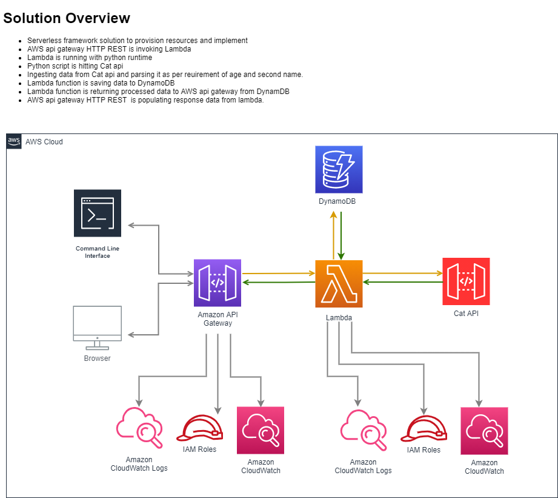

# http_api
This is sample rest http api serverless framework deployment with aws lambda python3.8 and api gateway without proxy integration. This solution ingest Data from an api using Lambda with python 3.8 runtime, parse that data and return the response to AWS Api Gateway with REST HTTP. This solution selects default aws region eu-west-2


## Problem Statement
This problem does have 2 parts. First one is to write python script and parse the data as per requirement and serve it as http api. In this solution we are only completing Part 1.

### Part 1
Write some code to fetch cat facts from the cat facts API: http://158.247.202.14:4141/facts
Filter the resulting data so that only cat facts where the cat age is lower than 10 years old and the second name begins with a specific set of letters. The set of letters is every other letter in the alphabet starting from A, e.g: A, C, E, G, …
Now serve this data up from your own HTTP API.


### Part 2
Write a cli tool that can be used to query cat facts from your new API, and also to delete entries. Allow outputting data in JSON, YAML, and table formats if time permits.
Mentione below is the part 2 solution design.


### Pre-requisites

- You need AWS Account with admin user to avoid permission problems.
- You must have centos or amazon linux 2 or you can use other distributions but require to search equivalent packages.

<!-- GETTING STARTED -->
### Getting Started

This project contains the aws resource definition for:
- A Lambda Function with python 3.8 runtime that will hit Cat api and get the data, this data will be parse and then will be return in the form of json.
- IAM Roles and CloudWatch logs for Lambda Function
- S3 bucket creation
- AWS REST HTTP API Gateway with lambda integration to serve the response of lambda as rest http api.


### Deployment Instructions

- Have ```aws cli``` installed
- Have ```python``` installed

- Configure AWS CLI
```
aws configure
```
Enter this region: eu-west-2

- Install NVM
```
wget -qO- https://raw.githubusercontent.com/nvm-sh/nvm/v0.37.0/install.sh | bash
```
If not worked then use
```
curl -o- https://raw.githubusercontent.com/creationix/nvm/v0.32.0/install.sh | bash
```
```
nvm --version
```

- Install NPM
```
curl http://npmjs.org/install.sh | sh
```
```
npm
```

- install git
```
yum install git
```

- Install Node
```
nvm install node -g
```
or try
```
nvm install node
```
```
node
```

- Install Serverless Framework
```
npm install  serverless
```
```
npx serverless  install -u https://github.com/hassanhashmy/http_api.git
```

- Run Python Script to See output (not compulsory)
```
chmod +x python.py
```
```
python python.py
```

- Deploy Part 1 Solution
```
cd http_api
```
```
npx serverless deploy
```

- Test Your Deployment
At the end of successful deployment you will see information like this

```
curl Your_Link # For example ```curl https://XXXXXXXXXXX.execute-api.eu-west-2.amazonaws.com/dev/```
```    
- Delete or Remove the Solution
```
npx serverless remove
```


### Contribution Instructions
The initial version of serverless framework is [here](https://github.com/serverless/examples/tree/master/aws-python-simple-http-endpoint)

- Install pip
```
curl -O https://bootstrap.pypa.io/get-pip.py
```
```
python3 get-pip.py --user
```
```
echo 'export PATH=~/.local/bin:$PATH' >> /root/.bash_profile
```
```
source /root/.bash_profile
```

- Install python libraries
```
cd http_api
```
```
pip install --target python requests
```

### Resources

- Python Script Help
https://towardsdatascience.com/how-to-pull-data-from-an-api-using-python-requests-edcc8d6441b1
https://www.askpython.com/python/examples/pull-data-from-an-api
https://python.gotrained.com/python-json-api-tutorial
https://www.w3schools.com/python/python_conditions.asp
http://sticksandstones.kstrom.com/appen.html

- Serverless Help
https://github.com/serverless/examples
https://github.com/serverless/examples/tree/master/aws-python-rest-api
https://github.com/serverless/examples/tree/master/aws-python-simple-http-endpoint

- Serverless AWS API GATEWAY Help
https://www.serverless.com/plugins/serverless-aws-documentation
https://www.serverless.com/framework/docs/providers/aws/events/apigateway
https://www.serverless.com/framework/docs/providers/aws/guide/serverless.yml
https://forum.serverless.com/t/setting-api-gateway-method-integration-response-request-with-lambda-integration/6772/2
https://www.activestate.com/blog/how-to-create-a-serverless-rest-api-with-python-and-aws-lambda
https://towardsdatascience.com/aws-lambda-amazon-api-gateway-not-as-daunting-as-they-sound-part-1-d77b92f53626
https://www.serverless.com/amazon-api-gateway
https://www.serverless.com/aws-http-apis
https://fathomtech.io/blog/http-api-error-handling-for-aws-lambda-and-api-gateway
https://medium.com/swlh/aws-lambda-function-with-amazon-api-gateway-as-the-trigger-8b9e5339e41e


- AWS Api Gateway
https://docs.aws.amazon.com/apigateway/latest/developerguide/http-api-vs-rest.html
https://docs.aws.amazon.com/apigateway/latest/developerguide/getting-started.html
https://aws.amazon.com/blogs/compute/announcing-http-apis-for-amazon-api-gateway
https://aws.amazon.com/blogs/compute/building-better-apis-http-apis-now-generally-available

- Part 2 Help AWS Api Gateway with DynamoDB
https://docs.aws.amazon.com/lambda/latest/dg/services-apigateway-tutorial.html
https://www.serverless.com/blog/flask-python-rest-api-serverless-lambda-dynamodb
