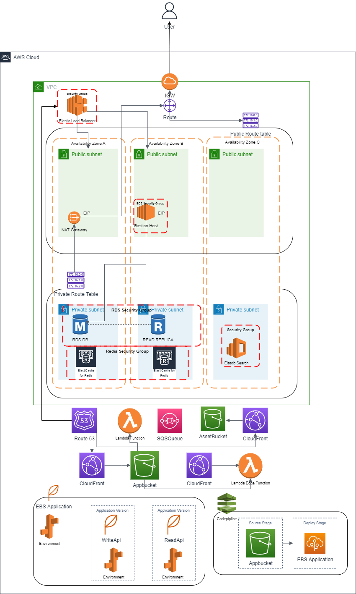

# AWS Terraform module

Terraform file which create the following modules.

- Network Module
- Bastion Module
- Resources Module
- Database Module
- Elasticbeanstalk Module
- ElasticSearch Module
- Lambda Module

## Prerequisite

| Name | Version |
| ------ | ------ |
| terraform | >= v1.1.7

If terrafrom is not installed, follow the guide to install terraform on windows and linux.
### Window Enviorment:
###### Step 1: Download the installation file
1. Navigate to the Terraform download page (https://www.terraform.io/downloads.html). It should list out Terraform downloads for various platforms.
2. It will download a zip file. Create a folder on the C drive as C:/terraform. Download the zip file in this folder. Unzip the file to extract the .exe file.

###### Step 2: Update Path Environment Variable

1. Next open the Start menu and search for Environment variables. Open the Environment variables settings page.
2. On the Environment variables edit page, open the Path variable.
3. On the opened Path pop up, click New and add the Terraform download folder. This is the folder where the zip file was downloaded and unzipped (C:/terraform).
4. Click OK on the above window to save the Path variable addition. If needed, restart your system to apply the variable changes.
5. Open a Command prompt and run this command to verify Terraform is installed successfully:
```sh
terraform --version
```

### Linux Enviorment:
###### Download the installation file
1. Make sure the system is up-to-date and install these packages which are needed for further steps:
```sh
sudo apt-get update && sudo apt-get install -y gnupg software-properties-common curl
```
2. Next add the Hashicorp GPG key needed by the repository:
```sh
curl -fsSL https://apt.releases.hashicorp.com/gpg | sudo apt-key add -
```
3. Then, add the official repository for HashiCorp for Linux:
```sh
sudo apt-add-repository "deb [arch=amd64] https://apt.releases.hashicorp.com $(lsb_release -cs) main"
```
4. Now that we have added the repo to the list, let’s update to add the relevant repository content:
```sh
sudo apt-add-repository "deb [arch=amd64] https://apt.releases.hashicorp.com $(lsb_release -cs) main"
```
5. Once update, run this command to install Terraform:
```sh
sudo apt-get install terraform
```
That should complete the installation. To verify the installation, run this and verify the output:
```sh
terraform --version
```

## AWS Architecture


## Steps to Create Modules

This is the first command that should be run after cloning files from version control. The command is used to initialize a working directory containing Terraform configuration files.

```sh
terraform init
```

This command is used to rewrite Terraform configuration files to a canonical format and style.

```sh
terraform fmt --check
```

Validate runs checks that verify whether a configuration is syntactically valid and internally consistent, regardless of any provided variables or existing state.

```sh
terraform validate
```

This command creates an execution plan, which lets you preview the changes that Terraform plans to make to your infrastructure.

```sh
terraform plan
```

Finally this command executes the actions proposed in a Terraform plan.

```sh
terraform apply
```

And a convenient way to destroy all remote objects managed by a particular Terraform configuration.

```sh
terraform destroy
```

By default all module will be created, but in order to limit the speific module, we can set input variables. Which will set whether the particular module should be created or not, by default all variable are set to true.

## Files Structure
```
.
├── Diagram.png
├── README.md
├── hello_lambda.zip
├── index.zip
├── layers
│   ├── bastion
│   │   ├── README.md
│   │   ├── main.tf
│   │   ├── outputs.tf
│   │   └── variables.tf
│   ├── database
│   │   ├── README.md
│   │   ├── main.tf
│   │   ├── outputs.tf
│   │   └── variables.tf
│   ├── elasticbeanstalk
│   │   ├── README.md
│   │   ├── main.tf
│   │   ├── outputs.tf
│   │   └── variables.tf
│   ├── elasticsearch
│   │   ├── README.md
│   │   ├── main.tf
│   │   ├── outputs.tf
│   │   └── variables.tf
│   ├── lambda
│   │   ├── README.md
│   │   ├── main.tf
│   │   ├── outputs.tf
│   │   └── variables.tf
│   ├── network
│   │   ├── README.md
│   │   ├── main.tf
│   │   ├── outputs.tf
│   │   └── variables.tf
│   └── resources
│       ├── README.md
│       ├── main.tf
│       ├── outputs.tf
│       └── variables.tf
├── main.tf
├── outputs.tf
└── variables.tf
```
**main:** This is our main configuration file where we are going to define our resource definition.\
**variables:** This is the file where we are going to define our variables.\
**outputs:** This file contains output definitions for our resources.\
**Diagram:** This contain the current AWS Structure Architecture diagram.\
**hello_lambda:** is a demo lambda function which is used in lambda module.
**index:** is a demo html page which is used cloud distribution in resource module.

## Inputs

| Name | Description | Default | Type 
| ------ | ------ | ------ | ------ |
| create_network | Set variable to true or false for network module creation | True | Optional
| create_bastion | Set variable to true or false for bastion module creation | True| Optional
| create_database | Set variable to true or false for bastion database creation | True| Optional
| create_elasticbeanstalk | Set variable to true or false for elasticbeanstalk module creation | True| Optional
| create_elasticsearch | Set variable to true or false for elasticsearch module creation | True| Optional
| create_lambda | Set variable to true or false for lambda module creation |True| Optional
| create_resources | Set variable to true or false for resources module creation |True| Optional

## Dependencies

The module have dependency resources that other module files references, that mean we need to create that module first in order to execute dependent module.

The module dependencies are as follow

- Network module doesn't have any depenedcies but it is basic module that is used in other module.
- Resources module have dependency on network module.
- Bastion module have dependency on network module.
- Database module have dependency on network module.
- Elasticbeanstalk module have dependency on resource module.
- ElasticSearch module have dependency on network module.
- Lambda module have dependency on resource module.


