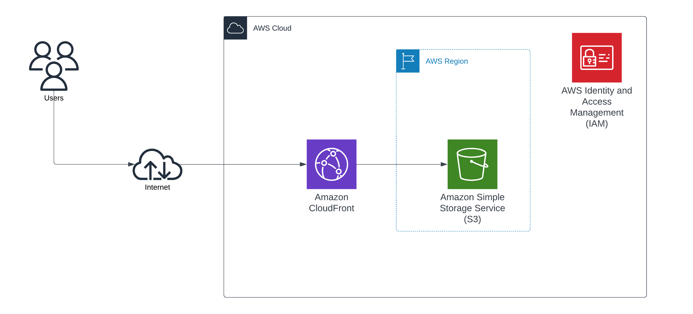

# A simple web application

This guides deploying a simple React web application to AWS S3 and CloudFront Distribution CDN with Terraform.

## Architecture

This architecture is automatically deployed using Hashicorp Terraform, an infrastructure as code tool. It uses Regional services such as Amazon S3 to store the web application and Amazon CloudFront content delivery network (CDN) to speeds up web content access securely and highly available.

Through using Amazon S3 and Amazon CloudFront, this architecture can survive an availability zone lost without affecting users experience. To achieve a much greater high availability, e.g, in an event of AWS region were to become temporarily unavailable, your users still can access the web content, see the Improvements section with Amazon CloudFront origin failover.



### Technology stack
- Amazon CloudFront
- Amazon S3
- Amazon IAM
- Terraform

### AWS services

- [Amazon Simple Storage Service (Amazon S3)](https://docs.aws.amazon.com/AmazonS3/latest/userguide/Welcome.html) is a cloud-based storage service that helps to store, protect, and retrieve any amount of data.
- [Amazon CloudFront](https://docs.aws.amazon.com/AmazonCloudFront/latest/DeveloperGuide/Introduction.html) helps to speed up distribution of the web content by delivering it securely through a worldwide network of data centers, which lowers latency and improves performance.

### Automation, security and scale

The deployment of application code and infrastructure resources will be handled by CI/CD pipelines with versioning tracked by version control system (VCS) such as GitHub or AWS CodeCommit.

This helps improving security by:
- Remove human operations from deployment
- Avoid secrets leaks such as AWS Access Keys, or any API tokens, etc might used later
- Automate secrets rotation
- Easily to audit

Automation with Terraform provides benefits
- Hide complexity from operational users or developers since they can use a Terraform module to create a web application with several inputs that includes project name, AWS region, or to create Amazon CloudFront distribution or not.
- As configuration is modular, it's virtually highly reusable on any systems that uses this web application architecture.
- You can create as many as infrastructure resources or environments, just by specifying different settings or inputs through the use of Terraform configuration.

### Improvements

There are a lot of rooms to improve this proposed solution. It depends on requirements of cost, performance, operation, security and reliability, consider the following improvements:
- Increasing availability with CloudFront origin failover. When this is configured, CloudFront automatically switches to a secondary origin when the primary origin is unavailable, hence, still provides web content access for users.
- Improving observability by adding [Amazon CloudWatch](https://docs.aws.amazon.com/AmazonCloudWatch/latest/monitoring/WhatIsCloudWatch.html) to monitor the metrics of your AWS resources and the deployed application on AWS in real time.
- For a scenario of using APIs, especially, JavaScript APIs, adding [Amazon API Gateway](https://docs.aws.amazon.com/apigateway/latest/developerguide/welcome.html) to technology stack helps to create, publish, maintain, monitor, and secure REST, HTTP, and WebSocket APIs at any scale.

## Prerequisites and limitations

### Prerequisites

- An active AWS account
- AWS CLI installed, and configured with AWS access keys. For more information, see the [Install of update the latest version of the AWS CLI](- Aws CLI
https://docs.aws.amazon.com/cli/latest/userguide/getting-started-install.html) documentation.
- Terraform installed. For more information, see the [Install Terraform](https://developer.hashicorp.com/terraform/install?product_intent=terraform) documentation.
- Node.js v20.9.0 or later installed. For more information, see the [Node.js Downloads](https://nodejs.org/en/download) documentation.
- Git installed and configured. For more information, see the [Git documentation](https://github.com/git-guides/install-git)

>**Notes**
>
> If you are using [devbox](https://www.jetpack.io/devbox/docs/), just issue `devbox shell` to get your computer's environment setup.

### Tested with
- Terraform v1.2.3
- aws cli aws-cli/2.12.0
- Node.js v20.9.0

## Infrastructure

This uses Terraform to ease of infrastructure provisioning with automation and avoid human error-prone. Terraform configuration includes:
- Create a S3 bucket to host the web application build
- Create a CloudFront that optimizes speed and make the web application highly available around the globe (by default, CloudFront distribution is only created in production environment)
- Each infrastructure environment is isolated in its own directory. Changes can be made without affecting other environments
- Shared configuration is made into modules which can be reusable.

Terraform configuration has made available inside `terraform/` directory.

The terraform directory tree includes several directories and files
```      
terraform/
|-- Makefile.in
|-- dev
|-- examples
|-- modules
`-- prod

3 directories, 1 file
```

- Makefile.in - a Makefile with shortcuts for Terraform core workflow
- dev - infrastructure configuration for dev, or develop environment
- examples - contains examples such as variable definitions, etc
- prod - infrastructure configuration for production environment
- modules - All Terraform modules shared by infrastructure environments


## Deployment

A deployment usually includes several steps:
- Create an infrastructure environment
- Deploy a build of the web application
- Decommission an infrastructure environment or destroy any resources were created to host the web application (usually use with dev environments while developing the web application)

### Create an infrastructure environment

**Step 1: Prepare required inputs for the infrastructure environment**

Copy the terraform.tfvars.example to `terraform/example/` and named it `terraform.tfvars`

```bash
cp terraform/examples/terraform.tfvars.example terraform/dev/terraform.tvars
```

A terraform.tfvars.example has the following content:
```
project="avocado"
environment="dev"
```

For example, after modifying, we have the following `terraform.tfvars`
```
project="dragonfruit"
environment="test"
```

>**Notes**
>
> If skipping this step, all required inputs will be asked while performing infrastructure planing or infrastructure environment creating later.

**Step 2: Make a terraform plan**

Terraform plan helps to plan what resources will be added to our infrastructure. To make a plan, issue:

```bash
make plan
```

>**Notes**
>
> Nothing is going to be created in planning phase yet.

**Step 3: Apply the generated Terraform plan**

After Terraform performed a plan, you can review resources and if everything is okay, apply the plan.

```bash
make apply
```

When being asked for confirmed, type in `yes` and press Enter to continue.

**Step 4: Export the S3 bucket name to shell environment (optional)**

Although, the bucket name can be copied using mouse but it's better to export it to shell environment variable which uses to deploy the web application later.

```
export S3_BUCKET=$(terraform output -raw bucket)
```

### Web application deployment

**Step 1: Build the app**

Change to the root project directory

```bash
cd ../../
```

And create a build with the following command:

```
yarn build
```

**Step 2: Deploy the build to S3 bucket**

Run the following command to deploy the app:

```
aws sync build/ s3://$S3_BUCKET
```

### Get website endpoint

To visit the recently deployed web application, we can get the website endpoint from Terraform configuration.

**Step 1: Change directory to infrastructure environment**

If you are still in root project directory, change to infrastructure configuration, for example, change to `dev`

```bash
cd terraform/dev
```

**Step 2: Get the output of website endpoint or DNS name**

Executes the following command to get website endpoint from Terraform state:

```bash
terraform output -raw website_endpoint
```

Depending on infrastructure environment, you might get different outputs. See examples below
- _dev_ : avocado-dev-828dc2706c.s3-website.eu-west-2.amazonaws.com
- _prod_ : d1y2fmvncxm6hy.cloudfront.net

You can now visit the website endpoint, for examp, https://d1y2fmvncxm6hy.cloudfront.net to view the web application.

### Decommission an infrastructure environment

This is to destroy resources were provisioned to host the web application that includes S3 or CloudFront, etc. It's often being done while developing and testing the web application.

To decommission, following those steps:

**Step 1: Change to the infrastructure environment directory**

```bash
cd terraform/prod
```

**Step 2: Confirm destroy behavior (optional)**

> This is only applied to production environment or an environment was created with `force_destroy` option set to `false`

Update `main.tf` with `force_destroy` to `true`

_Example_
```
provider "aws" {
  region = var.aws_region
}

module "app" {
  source = "../modules/apps/web"

  name        = var.project
  environment = "prod"

  create_cloudfront_distribution = true

  force_destroy = true
}
```

Apply force destroy with the following command:

```
make apply
```

When being asked for confirmation, type `yes` and press Enter.


**Step 3: Destroy the infrastructure environment**

Execute terraform destroy to destroy the infrastructure environment:

```bash
make destroy
```

When being asked for confirmation, type in `yes`, and press Enter to confirm.

Terraform will perform the destroy workflow, and you will have your infrastructure environment destroyed in a few minutes.
