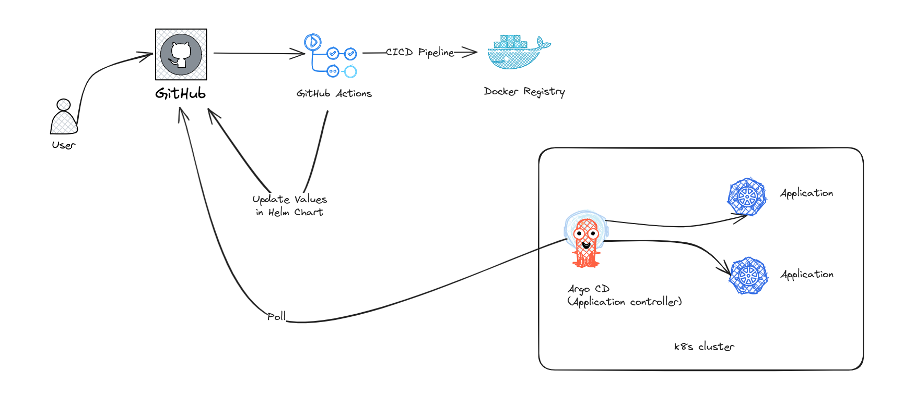

# Objective
We have a homogenous mixture of environments based on cloud as well as on-premise Kubernetes clusters. Some of our applications run on multiple instances while others are standalone. The configuration of the auxiliary services (databases, caches etc) might be different depending on the environment. Design a pipeline that fits the needs of such an infrastructure for our app. (Github actions, helm ,argocd are preferred).

#### Preferred technologies
- GitHub Actions
- Helm
- Argo CD


## Assumptions

There are several assumptions have been made:
1. Organization has a fictional name: acmecorp
2. The application name: awesomeapp
3. The integration platform: GitHub
4. Workflows managed by: GitHub Actions
5. The private registry: GitHub Package
6. ArgoCD has been installed into Kubernetes clusters and ready in production

### Module 1 - Pipeline Design

##### Requirements analysis

This covers a few requirements apply to CI/CD practices, pipelines, the integration platform, or a combination of tools that make up the integration infrastructure.

Table 1 - Requirements analysis

| Requirement | Description |
|--------|-------------|
| Branching strategy | Assumes a trunk-based workflow is being used. The mainline branch is master branch Shortlived feature branches are created when necessary, they are merged to master once passed all tests. |
| Test strategy | Implements code style checker |
| Release strategy | Deploying a release can happen as will. For example, once a day. |
| Tag everything | Each release will be tagged using a schematic versioning scheme. |
| Preferred Technologies | - Helm - Kubernetes - Native Cloud CI/CD tooling (Argo CD, etc) |


##### Pipeline Design
Based on requirements analysis, the pipeline consists of the following steps:

- GitHub Actions to test the application code style
- GitHub Actions build Docker images of the application
- Push Docker images to a private ECR repository
- Update the version of the new image in the Helm chart present in the Git repository (manual update)



These steps are explained in the below workflows:

Continuous Integration (CI) workflow triggered when code pushed to any branches except main branch, and it does the following things
- Build
- Run some linting (at this stage)

```

```
Continuous Deployment (CD) workflow triggered when code merged into main branch, and it does the following things:

- Login to Docker hub
- Create a tag
- Build a Docker image, and then push to Docker hub

```

```
Application source (Argo CD applications)

- Store Argo CD application manifests
- These manifests are monitored by Argo CD controller
- Once changes made to Helm values, a sync (or a deployment is reported in Argo CD dashboard
```

```
### Module 2 - Pipeline Design

##### Pre-tasks

Setup a local k8s cluster using minikube
```
curl -LO https://storage.googleapis.com/minikube/releases/latest/minikube-linux-amd64
```
```
sudo install minikube-linux-amd64 /usr/local/bin/minikube
```
Create a local k8s cluster
```
minikube start --insecure-registry "10.96.0.1/24"
```
Enable minikube registry
```
minikube addons enable registry
```
##### Part 1 - Containerize
Given the Ruby http server application is hosted at
https://github.com/sawasy/http_server/blob/main/http_server.rb we can use the Dockerfile to containerize the application.

The Dockerfile uses
- alpine to make artifacts smaller (The built package is around 60 MiB) (quick to build, fast to deploy)
- A init process for better managing ruby application

```
FROM ruby:3.1.2-alpine

# Add Tini - a tiny valid init
RUN apk add --no-cache tini
ENTRYPOINT ["/sbin/tini", "--"]

WORKDIR /app

COPY . .

EXPOSE 80

CMD ["ruby", "http_server.rb"]
```
Build a Docker image

```
docker build -t awesomeapp .
```
Push to Docker hub

```
# This assumes repository: acmecorp/awesomeapp
# image tag: latest
docker login
docker tag awesomeapp acmecorp/awesomeapp
```

##### Part 2 - Manifests
Create chart
```
helm create awesomeapp-chart
```
Tree of Chart
```
tree -L 2
.
|-- Chart.yaml
|-- charts
|-- templates
| |-- NOTES.txt
| |-- _helpers.tpl
| |-- deployment.yaml
| |-- hpa.yaml
| |-- ingress.yaml
| |-- service.yaml
| |-- serviceaccount.yaml
| `-- tests
|-- values-dev.yaml
`-- values.yaml
```
Helm Chart file contents
```
# charts/awesomeapp-chart/Chart.yaml
apiVersion: v2
name: awesomeapp-chart
description: A awesomeapp Helm chart for Kubernetes
# A chart can be either an 'application' or a 'library' chart.
#
# Application charts are a collection of templates that can be packaged into versioned archives
# to be deployed.
#
# Library charts provide useful utilities or functions for the chart developer. They're included as
# a dependency of application charts to inject those utilities and functions into the rendering
# pipeline. Library charts do not define any templates and therefore cannot be deployed.
type: application
# This is the chart version. This version number should be incremented each time you make changes
# to the chart and its templates, including the app version.
# Versions are expected to follow Semantic Versioning (https://semver.org/)
version: 0.1.0
# This is the version number of the application being deployed. This version number should be
# incremented each time you make changes to the application. Versions are not expected to
# follow Semantic Versioning. They should reflect the version the application is using.
# It is recommended to use it with quotes.
appVersion: "1.0.0"
```
```
```
```
```
```
```
```
```
```
```
```
```
```
```
```
```
Install Helm chart to local cluster
```
helm upgrade --install awesomeapp . -f values-dev.yaml
```

### Module 3 - Improvements
To make improvements to application pipeline, more analysis requirements are added in addition to requirements stated in Module 1.

| Requirement | Description |
|--------|-------------|
| Roll back supports | Supports roll back in case of deployments go wrong |
| Third party security scanning | Scan third party code or external packages for security potential |
| Malware scanning | ............. |
| Authenticated external libraries | All external packages or libraries |
| Compliance scanning | ............. |
| Test data is anonymous | ............. |